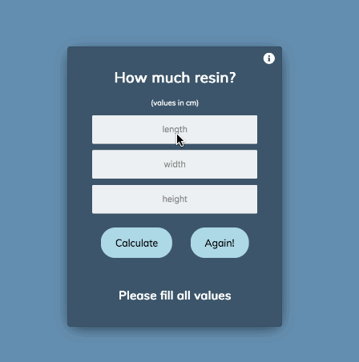

# how_much_resin?

This calculator is designed for counting the amount of epoxy resin used for casting.

For this you need to measure (in 'cm' and with '.' for decimals) approximate length, width and height of the gap you want to cast. Then fill in the input fields and push button 'calculate' :-)

The result is the exact amount of epoxy resin you need to use for casting.

I have used this method many times and it is always working great.

